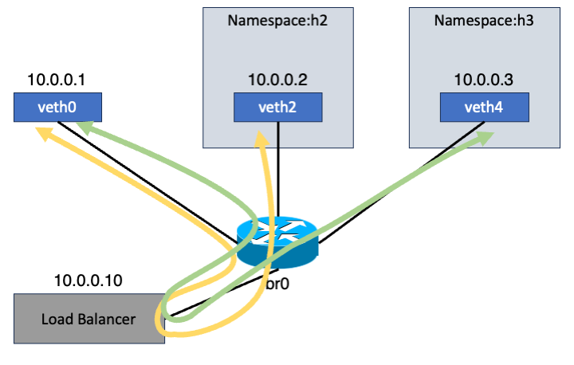

## Building and Running the Load Balancer

To get started, make sure you compile `libbpf`, which is a prerequisite for this project:

```bash
git submodule update --init --remote --recursive
cd external/libbpf
OBJDIR=build DESTDIR=install-dir make -C src install
```

Once that's complete, proceed to compile both the eBPF loader and the load balancer:

```bash
make all
```

---

## Creating the Test Environment

To simulate backend servers and networking behavior, we will manually construct a virtual network using Linux namespaces and a software bridge:

```bash
make topology
```

This will configure the required namespaces, virtual Ethernet pairs, and bridge interface.



If you need to remove the virtual environment later, you can clean everything up with:

```bash
make prune
```

or:

```bash
make clean
```

---

## Deploying the eBPF Program

After setting up the network, load the XDP program into the load balancer’s network interface like this:

```bash
sudo ip netns exec lb ./build/loader build/load_balancer.bpf.o xdp_lb veth6
```

To disable and unload the XDP program, run:

```bash
sudo ip netns exec lb ip link set dev veth6 xdpgeneric off
```

---

##  Results

At this point, you're ready to try out the load balancing mechanism. It's recommended to use a terminal multiplexer such as `tmux` to split your view into multiple sessions.

Start a simple TCP server using `netcat` in two of the server namespaces:

### Terminal 1 – Server A:

```bash
sudo ip netns exec h2 nc -k -l 8080
```

### Terminal 2 – Server B:

```bash
sudo ip netns exec h3 nc -k -l 8080
```

### Terminal 3 – Client:

```bash
nc 10.0.0.10 8080
```

When you send data from the client, one of the server namespaces should receive it depending on the balancing logic. By reconnecting multiple times, you'll notice that the message gets delivered to different servers across attempts — confirming the load balancing is working as expected.
